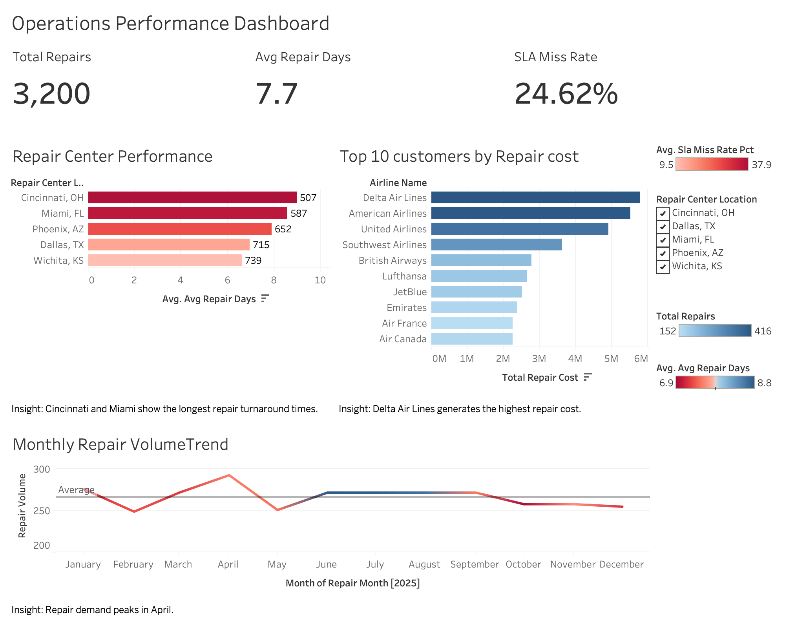

# Operations Performance Dashboard

An end-to-end analytics project built using **PostgreSQL** and **Tableau** to analyze aircraft repair operations.  
This dashboard helps identify repair center performance issues, customer repair demand, and operational trends over time.

---

## Project Overview

Aircraft repair operations require visibility into repair turnaround time, service performance, and customer demand.  
This project analyzes operational repair data and presents insights through an interactive Tableau dashboard.

The goal of this project was to:

- Analyze repair center performance
- Identify customers generating the highest repair demand
- Monitor monthly repair demand trends
- Track SLA service performance

---

## Tools Used

- **PostgreSQL** — relational database design and SQL analysis  
- **pgAdmin** — database management and data import  
- **Tableau** — dashboard design and data visualization  
- **GitHub** — version control and project documentation  

---

## Project Workflow

The project was completed through the following steps:

1. Designed a relational database structure for repair operations
2. Imported operational data into PostgreSQL
3. Created SQL queries and analytical views
4. Connected the database to Tableau
5. Built KPI metrics and visualizations
6. Designed an operations dashboard to communicate insights

---

## Tableau Dashboard

The final dashboard provides a high-level view of repair operations performance.

### KPI Metrics

- **Total Repairs** — total number of repair orders processed
- **Average Repair Days** — average turnaround time for repairs
- **SLA Miss Rate** — percentage of repairs that missed service-level targets

---

### Key Visualizations

**Repair Center Performance**

- Compares repair turnaround time across repair centers
- Highlights service performance using SLA miss rates

**Top 10 Customers by Repair Cost**

- Identifies airlines generating the highest repair demand
- Helps prioritize customer support and operational planning

**Monthly Repair Demand Trend**

- Shows how repair demand changes throughout the year
- Highlights seasonal demand patterns

---

## Key Insights

From the dashboard analysis:

- **Cincinnati and Miami** show the longest repair turnaround times.
- **Delta Air Lines** generates the highest repair cost among customers.
- Repair demand **peaks around April**.
- SLA miss rates vary across repair centers, indicating operational performance differences.

---

## Repository Structure

